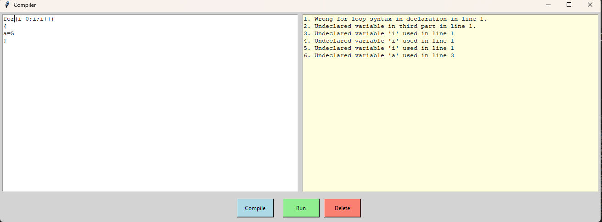

# **C++ Compiler - Lexical and Syntax Analysis**

## **Overview**
This project is a **custom compiler** implemented using **Python and Tkinter**, designed for **lexical analysis, syntax validation, and memory management**. It provides an interactive **GUI-based compiler** that processes code, identifies tokens, checks syntax, and reports errors.

## **Features**
- **Lexical Analysis**: Tokenizes input code, recognizing **reserved keywords, operators, brackets, identifiers, and symbols**.
- **Syntax Checking**: Validates the correct structure of programming constructs such as **loops, conditions, and assignments**.
- **Error Detection**: Identifies **undeclared variables, missing semicolons, bracket mismatches**, and invalid syntax.
- **Symbol Table Management**: Maintains **variable declarations, values, and types**.
- **Loop and Condition Handling**: Supports **for-loops, while-loops, if-else conditions, and switch-case statements**.
- **GUI Interface**: Built using **Tkinter**, allowing users to input code, run analysis, and view error reports.

## **Technologies Used**
- **Python** - Core programming language.
- **Tkinter** - GUI interface for compiling and displaying results.
- **TensorFlow/Keras** - For additional optimization (if used in future development).
- **Regular Expressions** - Used for pattern matching in token scanning.

## **Installation**
### **Prerequisites**
Ensure Python is installed, then install dependencies:
```bash
pip install tkinter numpy pillow opencv-python
```

### **Clone Repository**
```bash
git clone https://github.com/EnjyRamadan/C-Compiler.git
```
## **How to Run**

```bash
python main.py
```

## **How to Use**
1. **Enter Code**: Type or paste your code into the GUI text editor.
2. **Run Scanner**: Click the "Compile" button to analyze the syntax and tokens.
3. **View Results**: The compiler will display token classification, errors, and symbol tables.
4. **Fix Errors & Recompile**: Modify your code based on error messages and recompile.

## **Applications**
- **Programming Language Processing**: Analyzes code structure and tokenizes it for execution.
- **Educational Tool**: Helps students learn about **compilers, lexical analysis, and syntax parsing**.
- **Code Debugging**: Provides insights into syntax errors and variable mismanagement.

## **Screenshot**



